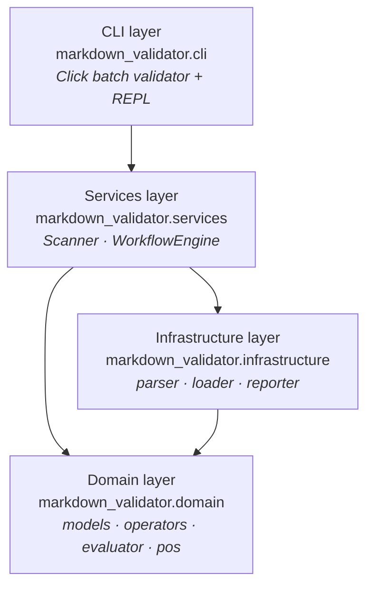
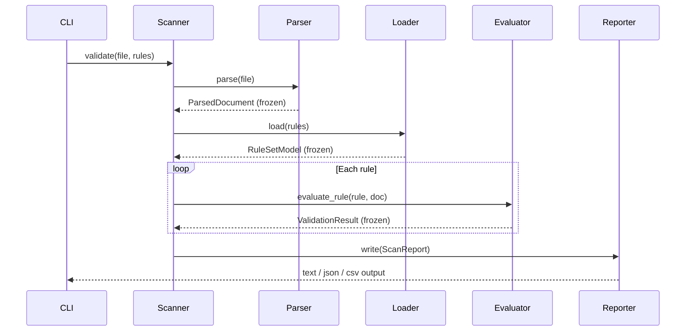

# Architecture

## Layer diagram



**Dependency rule**: each layer may only import from layers below it. The CLI never calls
infrastructure directly. Domain depends on nothing internal — no I/O, no side effects.

## Module responsibilities

| Layer | Module | Responsibility |
|---|---|---|
| Domain | `models.py` | Pydantic v2 contract models — all frozen |
| Domain | `operators.py` | Pure comparison strategy functions; `OPERATOR_REGISTRY` |
| Domain | `evaluator.py` | Apply a single `RuleModel` to a `ParsedDocument` → `ValidationResult` |
| Domain | `pos.py` | Thin NLTK wrapper for POS tagging and sentence counting |
| Infrastructure | `parser.py` | Read `.md` file → `ParsedDocument` (sole file reader for source docs) |
| Infrastructure | `loader.py` | Read JSON rule-set file → `RuleSetModel` (Repository pattern) |
| Infrastructure | `reporter.py` | Write `ScanReport` to JSON or CSV (sole file writer for output) |
| Services | `scanner.py` | Facade: compose parser + loader + evaluator → `ScanReport` |
| Services | `workflow.py` | Chain-of-Responsibility: execute workflow step sequences |
| CLI | `main.py` | Click batch CLI — parse args, call Scanner, render output |
| CLI | `repl.py` | Interactive `cmd.Cmd` REPL for rule development |

For the full design-pattern justifications, see [Design Document](design.md).

## Data flow



## Extension points

The architecture is designed so that common extensions touch exactly one module.

| What you want to add | Where to change | What to do |
|---|---|---|
| **New operator** (e.g., `>=`) | `domain/operators.py` | Add one function; add one entry to `OPERATOR_REGISTRY` |
| **New flag** (e.g., `word_count`) | `domain/evaluator.py` | Add one `elif` branch in the flag dispatch |
| **New report format** (e.g., Markdown table) | `infrastructure/reporter.py` | Add one `elif` branch in the format dispatch |
| **Different Markdown parser** | `infrastructure/parser.py` | Replace the `markdown` + `lxml` call; keep the `ParsedDocument` return type |
| **New workflow step pattern** | `services/workflow.py` | Add one `elif` branch in `_dispatch()` |

No extension requires touching the CLI or changing the Pydantic models (unless the
new capability requires a new contract field).

## Test organisation

The test suite mirrors the layer structure, so you know exactly where to add a test for
any change.

```
tests/
  unit/
    domain/
      test_models.py        ← Pydantic validation, coercions, frozen behaviour
      test_operators.py     ← one test per operator token
      test_evaluator.py     ← rule evaluation logic
    infrastructure/
      test_parser.py        ← parse front matter, render HTML, XPath availability
      test_loader.py        ← JSON loading, schema normalisation, backward compat
      test_reporter.py      ← JSON and CSV output format
    services/
      test_scanner.py       ← full validate() pipeline (in-memory rule injection)
      test_workflow.py      ← workflow step patterns
  integration/
    test_validate.py        ← CLI validate command end-to-end
  fixtures/
    checkworkflow.json      ← 26-rule reference rule set for integration tests
    concept.json            ← old-schema rule set (tests backward compat)
```

Coverage gate: ≥ 90% line coverage enforced by `pytest-cov` in CI. CLI modules
(`cli/main.py`, `cli/repl.py`) are excluded from the gate because they require a live
terminal. For requirements traceability, see the [SRS](srs.md).
