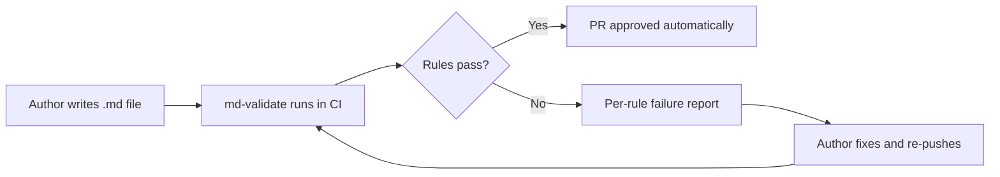
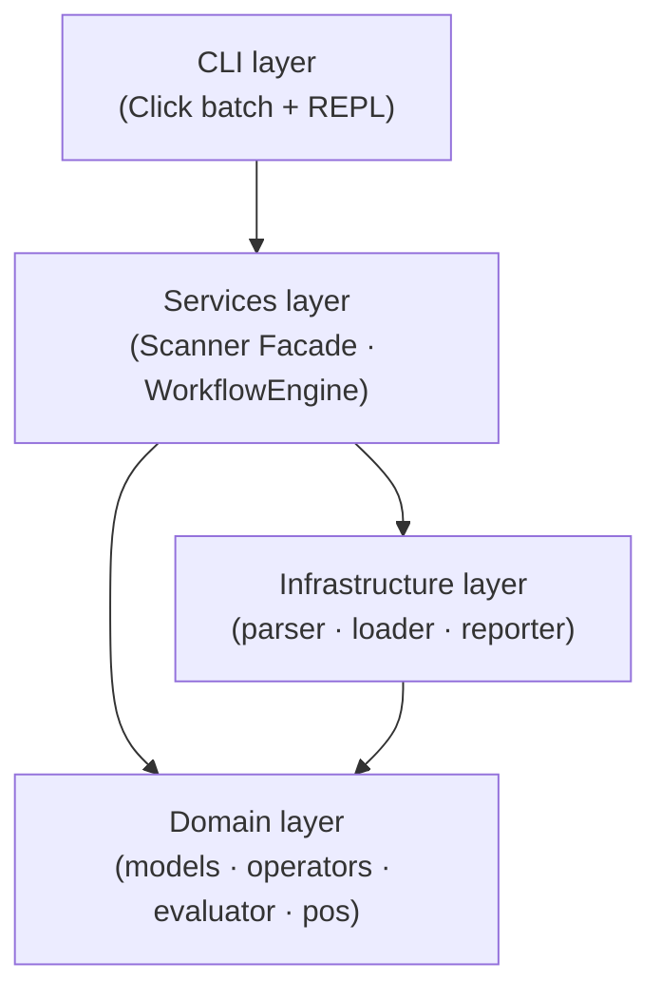
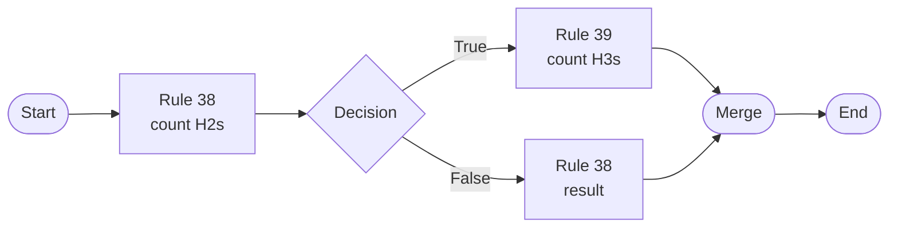
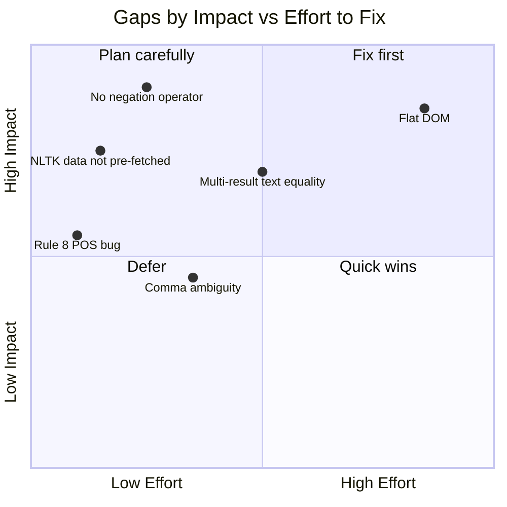

# Project Assessment: Premise and Implementation

*markdown-validator — Assessment Date: 2026-02-26 — Branch: review-and-changes*

---

## What the project sets out to do

The premise is clear and well-scoped: provide a declarative, JSON-configured linter for Markdown documentation files in large technical writing repositories. The target audience is documentation teams working at scale — specifically those managing Azure-style docs built with DocFX or Hugo — who need to enforce editorial style guides across hundreds or thousands of articles. Rules check two distinct concerns:

- **YAML front-matter metadata** — `ms.topic`, `ms.date`, `title`, `description`
- **Document body structure** — heading hierarchy, paragraph content, sentence count, part-of-speech

A workflow mini-language adds conditional multi-rule chains on top of individual rule results. The premise is legitimate and the problem is real: large doc repos suffer from inconsistent metadata, missing required sections, and authors who don't follow the editorial template. Automating these checks in CI reduces review burden significantly.

---

## Where the implementation handles it well

### Architecture and contracts

The 4-layer design (Domain → Infrastructure → Services → CLI) with Pydantic v2 contracts at every boundary is genuinely good engineering. The scanner can be unit-tested with in-memory rule sets; rules can be evaluated without touching the filesystem. The strategy pattern in `operators.py` makes adding a new operator a one-line change. 95.68% test coverage provides real confidence in the core logic.

### Operator richness

Nine string operators (`==`, `!=`, `>`, `<`, `[]`, `[:`, `:]`, `r`, `l`) plus `op_date`, sentence count (`s`), and part-of-speech (`p<N>`) cover a wide range of editorial checks. Most real-world rules — does the title contain a keyword, is the H1 under N characters, was the document updated this week — map cleanly to these operators.

### XPath querying

Using `lxml` with `etree.HTMLParser` to query the rendered HTML is the correct approach. It is fast, well-tested, and provides access to structural relationships (first paragraph, second H2, preceding siblings) that are impossible to express with regex over raw Markdown.

### Workflow branching

The mini-language handles conditional rule dependencies that simple lists cannot. For example, `usecase-38` (`S-38,38-D,T-39,F-38,39-M,M-E`) implements "if there are no H2s, check for no H3s" — a conditional dependency that would require complex nesting in any other approach.

### Schema resilience

The `inject_type_from_section` model validator and step-format normaliser (`(S,1)(1,E)` → `S-1,1-E`) handle real-world JSON inconsistencies gracefully without requiring migration of existing rule files.

---

## Where the implementation falls short

### 1. Flat DOM breaks structural XPath queries

The `markdown` library produces flat HTML: all headings sit as direct children of `<body>` with no section wrappers. Rule 24 (`.//h2[2]/following-sibling::a`) was designed to find links between the Prerequisites and Next Steps sections, but in flat HTML `following-sibling::a` returns every `<a>` that appears anywhere after the second H2 in document order. The structural intent is unenforceable without a DOM that wraps sections. Rules relying on within-section containment will silently produce wrong results.

### 2. Multi-result text equality is almost always wrong

When an XPath returns multiple elements (e.g., all H2s), the evaluator applies `all(truth)` — every element must satisfy the assertion. Rule 34 ("the second-to-last H2 is Clean up resources") uses `.//h2[last()]/preceding-sibling::h2` with `operation == '=='` and `value 'Clean up resources'`. That XPath returns all H2s preceding the last one. The `all()` logic then requires every one of them to equal `'Clean up resources'` — which fails for any document with more than two H2s. The correct XPath would be `.//h2[last()-1]`.

### 3. No negation operator forces brittle workflow inversion

Several rules express absence ("headings must NOT be numbered", "should NOT contain guide/article/topic"), but the rule language has no `not` flag or negation operator. Authors must invert the check through workflow branching, using a known-passing rule (typically rule 1, `ms.topic == tutorial`) as a true-sentinel. Rule 28's workflow (`S-28,28-D,F-1,T-28,28-M,M-E`) is supposed to enforce "H2s aren't numbered" but the branch logic is inverted — when all headings are numbered (bad), the workflow produces a passing state. A `negate: bool = False` field on `RuleModel` that flips the result in `evaluate_rule` would eliminate this entire class of problem.

### 4. Rule 8 has the wrong POS tag

Rule 8 ("H1 Tutorial: is followed by a verb") uses `operation 'p1'` with `value 'JJ'`. `JJ` is the Penn Treebank tag for *adjective*, not verb. Furthermore, position 1 in the text "Tutorial: Deploy a web app" is the word "Tutorial" itself (tagged `NN`), not "Deploy". The rule would need `operation 'p3'` and `value 'VB'` to match its stated intent. This is a bug in the reference rule data, not the engine, but it means `usecase-8` always fails on a correctly formatted tutorial H1.

### 5. NLTK data is not pre-fetched

`pos.py` calls `nltk.word_tokenize` and `nltk.pos_tag`, which require the `punkt_tab` and `averaged_perceptron_tagger_eng` corpora. There is no `nltk.download()` call in the package and no download step in the install instructions. A fresh install raises `LookupError: Resource punkt_tab not found` on the first POS-dependent rule.

### 6. Comma ambiguity in multi-value contains checks

Rule 14's value `'guide, article, topic'` is split on comma to produce three separate contains checks. This works here, but the same comma could also appear inside a single expected value. There is no escape mechanism. Additionally, the `[]` (contains) operator tests for *presence* — rule 14 passes when `'guide'` IS found in the document, which is the opposite of its stated intent ("should NOT include the terms"). The correct fix is a dedicated not-contains operator or a `negate` flag, rather than workflow inversion.

---

## Overall verdict

The architecture is sound and the operator set is rich enough for the majority of real-world editorial rules. The project handles its premise well for the 80% case: metadata validation, structural counts, and straightforward contains/regex body checks. It becomes unreliable for the harder cases: structural HTML queries that depend on section nesting, absence assertions, and multi-element equality checks.

The most impactful improvements, in priority order:

| Priority | Gap | Recommended fix |
|---|---|---|
| 1 | No negation operator | Add `negate: bool = False` to `RuleModel`; flip result in `evaluate_rule` before returning `ValidationResult` |
| 2 | NLTK downloads | Add download step to README; or call `nltk.download(quiet=True)` in `pos.py` module init |
| 3 | Multi-result text equality | Change `all(truth)` to `any(truth)` when `operation == '=='` and result set has more than one element |
| 4 | Rule 8 POS bug | Fix to `operation: 'p3'`, `value: 'VB'` in `checkworkflow.json` |
| 5 | Rules 28/29 inverted regex | Invert regex value to `^([^0-9])` or add `negate` flag; fix workflow branch order |
| 6 | Rule 34 multi-H2 equality | Change XPath to `.//h2[last()-1]` to target the second-to-last element directly |
| 7 | Flat DOM | Document the limitation; or adopt `markdown-it-py` with a section-wrapper plugin |

None of these require architectural changes — the layering and Pydantic contracts make each fix local to a single module or rule file.
