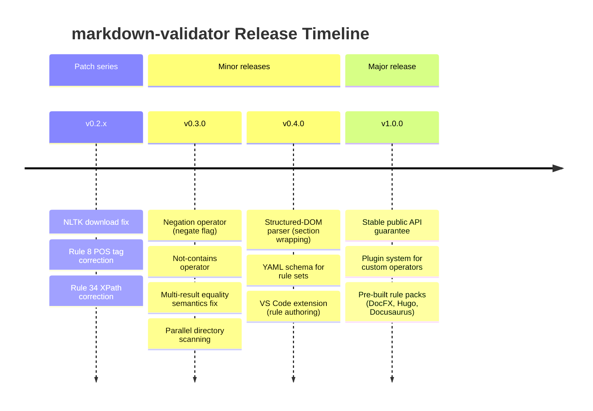
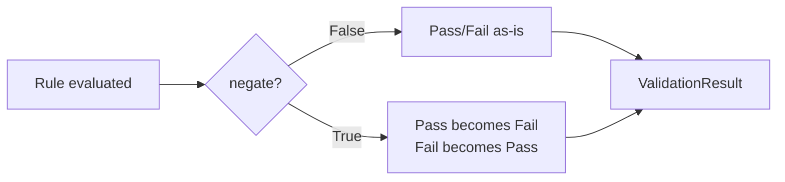

# Product Roadmap

*markdown-validator — as of 2026-03-20*

This roadmap is driven by the findings in the [Project Assessment](assessment.md) and by
real-world usage patterns observed in large documentation repositories.

---

## Guiding principles

1. **Rule authors should not need to understand the engine to express intent.** If a rule
   requires workflow inversion to express absence, the abstraction has failed.
2. **Silent wrong answers are worse than loud errors.** Flat-DOM structural queries can
   silently return wrong results; this must be surfaced before v1.0.
3. **The architecture is the moat.** The 4-layer design enables fast, targeted fixes.
   Each improvement should be local to one module.

---

## Timeline overview



---

## v0.2.x — Patch series (current)

These are targeted bug fixes with no API or schema changes.

| Fix | File | Change |
|---|---|---|
| NLTK data download | `README.md` + `pos.py` | Add `nltk.download(quiet=True)` guard to `pos.py` module init; add install step to README |
| Rule 8 POS bug | `tests/fixtures/checkworkflow.json` | Change `operation` to `"p3"`, `value` to `"VB"` |
| Rule 34 XPath | `tests/fixtures/checkworkflow.json` | Change XPath to `.//h2[last()-1]` |
| Rules 28/29 inversion | `tests/fixtures/checkworkflow.json` | Invert regex to `^([^0-9])` |

**No API changes. No migration required.**

---

## v0.3.0 — Rule language enhancements

Target: Q2 2026

### Negation operator

Add a `negate: bool = False` field to `RuleModel`. When `True`, the boolean result of
`evaluate_rule` is flipped before it is wrapped in `ValidationResult`. This eliminates
the entire class of brittle workflow-inversion patterns used to express absence.



**Affected modules**: `domain/models.py`, `domain/evaluator.py`
**Migration**: Existing rule files without `negate` default to `false`; fully backward compatible.

### Not-contains operator (`![]`)

A dedicated `![]` operator for "does not contain". Eliminates the need to use `[]` with
workflow inversion for absence checks (e.g., "title must not contain the word 'guide'").

**Affected modules**: `domain/operators.py` (one new function + one registry entry)

### Multi-result equality semantics

When an XPath expression returns multiple elements and the operation is `==`, the current
`all(truth)` aggregation almost always produces the wrong result for real rules. Change
the aggregation to `any(truth)` for equality checks on multi-element result sets, and
document the behaviour explicitly.

**Affected modules**: `domain/evaluator.py`

### Parallel directory scanning

`Scanner.validate_directory()` currently processes files sequentially.
Add an optional `workers: int = 1` parameter that uses `concurrent.futures.ThreadPoolExecutor`
for parallel validation. Default remains sequential (backward compatible).

**Affected modules**: `services/scanner.py`

---

## v0.4.0 — Structural improvements

Target: Q3 2026

### Structured-DOM parser

The current `markdown` library produces flat HTML; all headings are direct children of
`<body>`. This prevents within-section XPath queries. Replace or augment the parser with
one that wraps headings and their content in `<section>` elements, enabling:

```xpath
//section[h2[text()='Prerequisites']]//a
```

**Options to evaluate**: `markdown-it-py` + `mdit-py-plugins`; `mistletoe`; custom
post-processing of `lxml` tree.

**Affected modules**: `infrastructure/parser.py` (isolated — no other layers change)

### YAML schema for rule sets

Provide a JSON Schema (or Pydantic model export) for rule-set files. Enable IDE
validation of rule files. Publish schema to `docs/schema/ruleset.schema.json`.

### VS Code extension — rule authoring support

A thin VS Code extension that:
- Validates rule-set JSON files against the published schema
- Provides IntelliSense for flag and operator values
- Runs `md-validate` on the active file from the command palette

---

## v1.0.0 — Stable release

Target: Q4 2026

### Stable public API guarantee

Commit to semantic versioning for `Scanner`, `ScanReport`, `RuleModel`, and all Pydantic
models. Document breaking-change policy.

### Plugin system for custom operators

Allow third-party packages to register operators via a `markdown_validator.operators`
entry point. This keeps the core small while enabling domain-specific checks
(e.g., terminology validators, link checkers).

### Pre-built rule packs

Ship installable rule pack packages for common static site generators:

| Package | Targets |
|---|---|
| `markdown-validator-docfx` | DocFX metadata, ms.topic values, H1 conventions |
| `markdown-validator-hugo` | Hugo front-matter, archetypes, shortcode patterns |
| `markdown-validator-docusaurus` | Docusaurus metadata, sidebar_label, slug |

---

## What is explicitly out of scope

- **Real-time editor linting** (language server protocol) — this is a CI/batch tool.
- **Markdown auto-fixing** — the tool reports; it does not rewrite content.
- **Non-Markdown file types** — scope is `.md` files only.
- **Cloud service / SaaS** — the tool is intentionally local-first.
