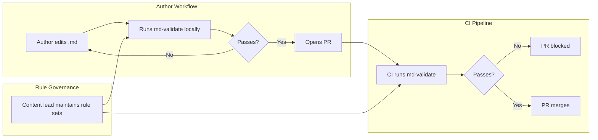
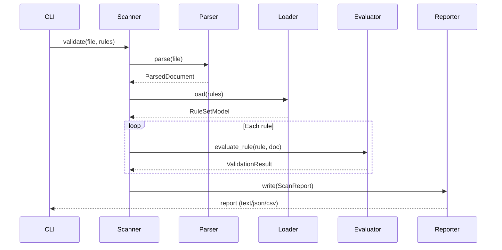

# Software Requirements Specification

**Project**: markdown-validator
**Standard**: IEEE 830-1998 (Software Requirements Specifications)
**Version**: 1.0 (covering v0.2 current and v0.3–v1.0 planned)
**Date**: 2026-03-20
**Author**: Matt Briggs

---

## Table of Contents

1. [Introduction](#1-introduction)
2. [Overall Description](#2-overall-description)
3. [Specific Requirements — Current (v0.2)](#3-specific-requirements--current-v02)
4. [Specific Requirements — Planned (v0.3–v1.0)](#4-specific-requirements--planned-v03v10)
5. [Non-Functional Requirements](#5-non-functional-requirements)
6. [Constraints and Assumptions](#6-constraints-and-assumptions)
7. [Appendix — Terminology](#7-appendix--terminology)

---

## 1. Introduction

### 1.1 Purpose

This document specifies the requirements for `markdown-validator`, a rule-based linting
tool for Markdown documentation files used in static site generators. It is intended for:

- **Developers** implementing or extending the tool
- **Technical writers** authoring rule sets
- **DevOps engineers** integrating the tool into CI/CD pipelines
- **Product stakeholders** evaluating capabilities and planning releases

### 1.2 Scope

`markdown-validator` validates Markdown files against a declarative JSON rule set. It is
a command-line tool and Python library. It is not an editor plugin, auto-fixer, or
general-purpose static analysis framework.

**In scope:**
- YAML front-matter metadata validation
- Document body validation via XPath on rendered HTML
- Conditional rule chains (workflow mini-language)
- Batch directory scanning with file-level reporting
- Interactive REPL for rule development

**Out of scope:**
- Auto-correcting document content
- Validating non-Markdown file formats
- Language Server Protocol / real-time linting
- Cloud service or SaaS deployment

### 1.3 Definitions, Acronyms, and Abbreviations

| Term | Definition |
|---|---|
| Rule | A single assertion about a document's metadata or body |
| Rule set | A JSON file containing a collection of rules and workflows |
| Front matter | The YAML block delimited by `---` at the start of a Markdown file |
| XPath | XML Path Language; used to query the rendered HTML DOM |
| Workflow | An ordered chain of rule evaluations with conditional branching |
| Operator | A comparison function applied to a query result and an expected value |
| Flag | Processing mode that determines how a query result is extracted |
| ScanReport | The aggregated output of validating one file against a rule set |
| DOM | Document Object Model; the tree representation of the rendered HTML |
| CI/CD | Continuous Integration / Continuous Delivery |
| REPL | Read–Eval–Print Loop; interactive command-line environment |
| Penn Treebank | Standard part-of-speech tag set used by NLTK |

### 1.4 References

- [Architecture Overview](architecture.md)
- [Design Document](design.md)
- [Rules Reference](rules-reference.md)
- [CLI Reference](cli-reference.md)
- [Product Assessment](product/assessment.md)
- [Product Roadmap](product/roadmap.md)
- IEEE Std 830-1998, IEEE Recommended Practice for Software Requirements Specifications

### 1.5 Overview

Section 2 describes the product context and user characteristics.
Sections 3 and 4 contain detailed functional requirements, organised by the current (v0.2)
and planned (v0.3–v1.0) versions.
Section 5 covers non-functional requirements.
Section 6 documents constraints and assumptions.

---

## 2. Overall Description

### 2.1 Product Perspective

`markdown-validator` is a standalone CLI tool and Python library. It sits in a CI/CD
pipeline as a pre-merge gate, or is run locally by authors during document development.



It does not depend on any external service. All validation runs locally against rule-set
files that are version-controlled alongside the documentation repository.

### 2.2 Product Functions

At the highest level, the product does three things:

1. **Parse** — Read a `.md` file and extract its YAML front matter and rendered HTML body.
2. **Evaluate** — Apply each rule in a rule set to the parsed document; produce a pass/fail result per rule.
3. **Report** — Aggregate results into a score and emit a human-readable or machine-readable report.

Workflows add a fourth function:

4. **Chain** — Execute conditional multi-rule sequences where the outcome of one rule
   determines which rule runs next.

### 2.3 User Characteristics

| User type | Technical level | Primary interaction |
|---|---|---|
| **Technical writer** | Low–medium | Runs `md-validate validate` against their own files; reads text reports |
| **Content lead / editor** | Medium | Authors and maintains rule-set JSON files; uses the REPL |
| **DevOps / platform engineer** | High | Integrates the CLI into CI pipelines; consumes JSON/CSV reports |
| **Python developer** | High | Uses the `Scanner` Python API; extends operators or parsers |

### 2.4 Constraints

- Python 3.12 or later is required.
- YAML front matter (`---` block) is mandatory; plain Markdown files without front matter are rejected.
- The `markdown` library renders Markdown to flat HTML; within-section XPath containment queries are not supported in v0.2 (planned for v0.4).
- NLTK corpora (`punkt_tab`, `averaged_perceptron_tagger_eng`) must be downloaded before POS/sentence rules can run.

### 2.5 Assumptions and Dependencies

- Rule-set JSON files are valid UTF-8.
- The tool is invoked by a user or CI agent with read access to the target `.md` files and the rule-set file.
- Output directories (for `--output`) are writable by the invoking process.
- The host system has network access at install time (for NLTK corpus download).

---

## 3. Specific Requirements — Current (v0.2)

### 3.1 Parsing requirements

**PR-1** The parser shall accept any UTF-8 encoded `.md` file that begins with a YAML front-matter block delimited by `---`.

**PR-2** The parser shall extract all YAML key-value pairs from the front-matter block into a dictionary accessible as metadata.

**PR-3** The parser shall render the Markdown body (the content after the closing `---`) to HTML using the `markdown` library with the `tables` and `fenced_code` extensions enabled.

**PR-4** The parser shall parse the rendered HTML into an `lxml` element tree using `etree.HTMLParser`, making the DOM available for XPath evaluation.

**PR-5** The parser shall raise a `ParseError` (not silently fail) if the file does not contain a valid front-matter block.

**PR-6** The parsed document shall be an immutable value object (`ParsedDocument` frozen dataclass); the parser shall not mutate it after construction.

### 3.2 Rule loading requirements

**RL-1** The loader shall accept a path to a JSON file conforming to the rule-set schema defined in [Design — Contract Schemas](design.md#5-contract-schemas).

**RL-2** The loader shall coerce integer `id` values that are represented as strings in the JSON to `int` at load time, for backward compatibility.

**RL-3** The loader shall accept workflow `steps` in both the canonical `S-1,1-E` format and the parenthesised `(S,1)(1,E)` format, normalising both to canonical form.

**RL-4** The loader shall inject a `type` field (`"header"` or `"body"`) from the section name when a rule object does not include a `type` field.

**RL-5** The loader shall raise a `ValidationError` if the JSON file fails Pydantic schema validation.

**RL-6** The loaded rule set shall be an immutable value object (`RuleSetModel`); the loader shall not mutate it after construction.

### 3.3 Evaluation requirements

**EV-1** The evaluator shall apply each rule to the parsed document and return a `ValidationResult` that is either `passed=True` or `passed=False`, with a copy of the rule's `mitigation` string on failure.

**EV-2** For **header** rules, the evaluator shall:
- Retrieve the metadata value at `rule.query` from `ParsedDocument.metadata`.
- Apply the flag processing mode (`value`, `check`, `date`, `pattern`) as specified in the [Rules Reference](rules-reference.md).
- Apply the operator from `OPERATOR_REGISTRY` identified by `rule.operation`.

**EV-3** For **body** rules, the evaluator shall:
- Execute `rule.query` as an XPath expression against `ParsedDocument.html_tree`.
- Apply the flag processing mode (`count`, `text`, `dom`, `all`) to extract a result string.
- Apply the operator from `OPERATOR_REGISTRY`.

**EV-4** For operators that expect numeric operands (`>`, `<`, `l`, `s`), the evaluator shall coerce the extracted string to `int` before comparison.

**EV-5** The evaluator shall return `passed=False` (not raise) when:
- A metadata key is absent and the flag is `value` or `date`
- An XPath expression matches zero nodes and the flag is `text` or `dom`

**EV-6** The evaluator shall return `passed=True` when:
- The flag is `check` and the metadata key is present (regardless of value)

### 3.4 Operator requirements

**OP-1** The following operators shall be registered in `OPERATOR_REGISTRY` and behave as specified in the [Rules Reference — Operators](rules-reference.md#operators):

| Operator token | Behaviour |
|---|---|
| `==` | String equality after whitespace strip |
| `!=` | String inequality after whitespace strip |
| `>` | Integer greater-than |
| `<` | Integer less-than |
| `[]` | Case-insensitive substring containment |
| `[:` | String starts-with |
| `:]` | String ends-with |
| `r` | Python `re.search` with `DOTALL` flag |
| `l` | `len(result) < int(value)` |
| `s` | NLTK sentence count `<= int(value)` |
| `p<N>` | Penn Treebank POS tag at word position N |

**OP-2** Each operator shall be a pure function `(result: str, value: str) -> bool` with no side effects.

**OP-3** A new operator shall be addable by: (a) defining one function in `operators.py`, (b) adding one entry to `OPERATOR_REGISTRY`. No other module shall require modification.

### 3.5 Workflow requirements

**WF-1** The workflow engine shall accept a workflow definition as a string of comma-separated `<source>-<target>` step tokens.

**WF-2** The following twelve step patterns shall be recognised and dispatched:

| Pattern | Meaning |
|---|---|
| `S-N` | Start; load rule N as initial state |
| `N-D` | Rule N result becomes the decision point |
| `M-D` | Merge state becomes the decision |
| `T-N` | If decision True, load rule N |
| `F-N` | If decision False, load rule N |
| `T-R` | If decision True, reverse (negate) it |
| `F-R` | If decision False, reverse (negate) it |
| `N-M` | Rule N exits into merge state |
| `M-N` | Merge state exits to rule N |
| `M-E` | Merge state ends workflow |
| `N-E` | Rule N result ends workflow |
| `N-N` | Both rules must pass |

**WF-3** The workflow engine shall return a `WorkflowResult` for each workflow, with `passed` set to the final boolean state of the workflow execution.

**WF-4** The workflow engine shall not raise on an unknown step pattern; it shall emit a warning and treat the step as a no-op.

### 3.6 Scanning requirements

**SC-1** `Scanner.validate(file_path, rules_path)` shall return a `ScanReport` containing:
- One `ValidationResult` per rule in the rule set
- One `WorkflowResult` per workflow in the rule set
- `passed: bool` — True if all `Required`-level rules passed
- `score: int` — count of passing rules
- `total_rules: int` — count of all rules

**SC-2** `Scanner.validate_directory(dir_path, rules_path)` shall recursively find all `.md` files in `dir_path` and call `validate()` on each, returning a list of `ScanReport`.

**SC-3** The scanner shall catch `ParseError` per file and record it as a failed scan for that file without aborting the directory scan.

### 3.7 CLI requirements

**CLI-1** The `md-validate validate TARGET --rules RULES` command shall call `Scanner.validate()` or `Scanner.validate_directory()` and print the report to stdout.

**CLI-2** The `--format` option shall accept `text` (default), `json`, and `csv`.

**CLI-3** The `--output DIR` option shall write one report file per validated `.md` file into `DIR`.

**CLI-4** The CLI shall exit with code `0` if all `Required` rules passed, and `1` if any `Required` rule failed.

**CLI-5** The `md-validate repl` command shall start an interactive session supporting the commands: `load`, `dump metadata`, `dump html`, `query`, `get`, `eval`, `quit`.

### 3.8 Reporting requirements

**RP-1** Text-format reports shall include, for each rule: rule ID, rule name, pass/fail status, and the mitigation message on failure.

**RP-2** JSON-format reports shall be valid JSON objects containing all fields of `ScanReport`.

**RP-3** CSV-format reports shall include one row per rule with columns for rule ID, name, type, level, and pass/fail status.

---

## 4. Specific Requirements — Planned (v0.3–v1.0)

### 4.1 Negation operator (v0.3)

**NEG-1** `RuleModel` shall include a `negate: bool` field, defaulting to `False`.

**NEG-2** When `negate` is `True`, the evaluator shall flip the boolean result of the operator comparison before constructing `ValidationResult`.

**NEG-3** Rule files that omit `negate` shall behave identically to the current behaviour (backward compatible).

**NEG-4** The `negate` field shall be documented in the Rules Reference with at least two examples: absence check and inverted contains check.

### 4.2 Not-contains operator (v0.3)

**NTC-1** A `![]` operator shall be registered in `OPERATOR_REGISTRY` that returns `True` when the result does NOT contain the value (case-insensitive).

**NTC-2** The `![]` operator shall support comma-separated multi-values with the same semantics as `[]`.

**NTC-3** Existing rules using `[]` with workflow inversion shall be migrated to `![]` in the reference rule sets.

### 4.3 Multi-result equality semantics (v0.3)

**MRE-1** When an XPath expression returns more than one element and `operation` is `==`, the evaluator shall use `any(truth)` aggregation (at least one element satisfies) rather than `all(truth)`.

**MRE-2** The change in aggregation semantics shall be documented in the Rules Reference under "Multi-element XPath results".

**MRE-3** Rules that previously relied on `all(truth)` behaviour shall be audited and updated in the reference rule sets.

### 4.4 Parallel directory scanning (v0.3)

**PDS-1** `Scanner.validate_directory()` shall accept an optional `workers: int` parameter (default `1`).

**PDS-2** When `workers > 1`, the scanner shall use `concurrent.futures.ThreadPoolExecutor` to process files in parallel.

**PDS-3** The `--workers N` CLI option shall pass `workers=N` to `validate_directory()`.

**PDS-4** The order of results in the returned list shall be deterministic (sorted by file path) regardless of the value of `workers`.

### 4.5 Structured-DOM parser (v0.4)

**SDP-1** The parser shall offer an opt-in structured-DOM mode that wraps heading content in `<section>` elements, enabling within-section XPath queries.

**SDP-2** In structured-DOM mode, all content between one heading and the next shall be wrapped in `<section class="hN">` where N is the heading level.

**SDP-3** The structured-DOM mode shall be activated by `Parser(structured=True)` or `--structured` on the CLI.

**SDP-4** The default (unstructured) mode shall remain unchanged for backward compatibility.

**SDP-5** The Rules Reference shall document which XPath patterns require structured mode.

### 4.6 YAML rule-set schema (v0.4)

**YRS-1** The package shall export a JSON Schema document for rule-set files to `docs/schema/ruleset.schema.json`.

**YRS-2** The schema shall be generated from the Pydantic `RuleSetModel` using `model_json_schema()`.

**YRS-3** The published schema shall be versioned alongside the package and updated on every release that changes the rule-set format.

### 4.7 Plugin system for custom operators (v1.0)

**PLG-1** Third-party packages shall be able to register custom operators via the `markdown_validator.operators` entry point in their `pyproject.toml`.

**PLG-2** Operator plugins shall follow the same interface as built-in operators: `(result: str, value: str) -> bool`.

**PLG-3** The package shall document the plugin contract and provide a minimal example plugin in the repository.

### 4.8 Pre-built rule packs (v1.0)

**PRP-1** The project shall publish at least one installable rule-pack package (`markdown-validator-docfx`) containing a ready-to-use rule set for DocFX documentation repositories.

**PRP-2** Rule packs shall be versioned independently of the core tool.

**PRP-3** Rule packs shall document every rule they contain: intent, query, operator, expected value, and mitigation.

---

## 5. Non-Functional Requirements

### 5.1 Performance

**PERF-1** A single-file validation (parse + evaluate + report) shall complete in under 500 ms on a modern laptop for documents up to 10,000 words.

**PERF-2** A 1,000-file directory scan shall complete in under 60 seconds (sequential mode) on a modern laptop.

**PERF-3** Memory usage per file shall not exceed 50 MB; the scanner shall not retain parsed documents after reporting.

### 5.2 Reliability

**REL-1** The test suite shall maintain ≥ 90% line coverage, measured by `pytest-cov`, as a CI gate.

**REL-2** A `ParseError` on one file during a directory scan shall not abort the scan of remaining files.

**REL-3** All Pydantic models shall be frozen; no mutable state shall cross layer boundaries.

### 5.3 Usability

**USE-1** The CLI `--help` output shall list all commands, options, and exit codes.

**USE-2** Failure reports shall include the rule's `mitigation` message verbatim, so the author knows exactly what to fix.

**USE-3** The REPL shall print a `help` summary on startup listing all available commands.

### 5.4 Maintainability

**MNT-1** Each layer (domain, infrastructure, services, CLI) shall have no imports from a layer above it in the dependency hierarchy.

**MNT-2** Adding a new operator shall require changes to exactly two locations: the function definition and the registry entry in `operators.py`.

**MNT-3** All public functions and classes shall have docstrings in Sphinx format.

### 5.5 Security

**SEC-1** The tool shall not execute arbitrary code from rule-set files; XPath expressions are evaluated against the document DOM only.

**SEC-2** The tool shall not make network requests during validation; all resources (NLTK corpora) shall be pre-downloaded at install time.

**SEC-3** The tool shall not write files outside the directory specified by `--output`.

### 5.6 Portability

**PRT-1** The tool shall run on Linux, macOS, and Windows with Python 3.12+.

**PRT-2** The tool shall not depend on any platform-specific libraries beyond what is declared in `pyproject.toml`.

---

## 6. Constraints and Assumptions

### 6.1 Technical constraints

- Python 3.12 or later is required (uses `match`/`case`, `tomllib`, and modern type hints).
- Markdown files must use UTF-8 encoding.
- YAML front matter delimited by `---` is mandatory; the tool is not designed for frontmatter-free Markdown.
- The `markdown` library (v3.x) is used for HTML rendering; its flat DOM is a known constraint until v0.4.

### 6.2 Organisational constraints

- The rule-set format is versioned by the package; breaking changes to the schema require a major version bump.
- CI integration is the primary deployment target; the tool must be installable in a fresh virtual environment with a single `pip install`.

### 6.3 Assumptions

- Rule-set authors have basic familiarity with XPath 1.0 for body rules.
- The documentation repository being validated follows a consistent front-matter structure.
- NLTK corpora are downloaded once per environment; they are not re-downloaded on every run.

---

## 7. Appendix — Terminology

### Rule-set schema quick reference

```json
{
  "rules": {
    "header": [
      {
        "id": 1,
        "name": "string",
        "type": "header",
        "query": "metadata-key",
        "flag": "value | check | date | pattern",
        "operation": "== | != | > | < | [] | [: | :] | r | l",
        "value": "expected-value",
        "level": "Required | Suggested",
        "mitigation": "string"
      }
    ],
    "body": [
      {
        "id": 2,
        "name": "string",
        "type": "body",
        "query": "/xpath/expression",
        "flag": "count | text | dom | all",
        "operation": "== | != | > | < | [] | r | l | s | p<N>",
        "value": "expected-value",
        "level": "Required | Suggested",
        "mitigation": "string"
      }
    ]
  },
  "workflows": [
    {
      "name": "string",
      "steps": "S-1,1-E",
      "level": "Required | Suggested",
      "fix": "string"
    }
  ]
}
```

### Data flow summary


